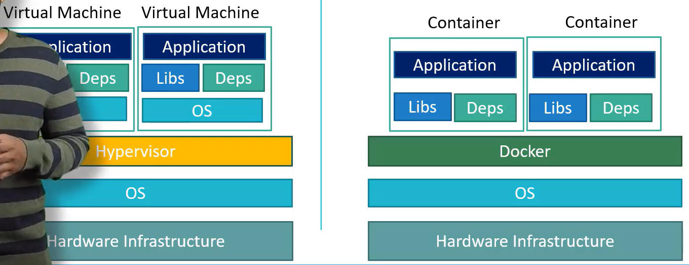
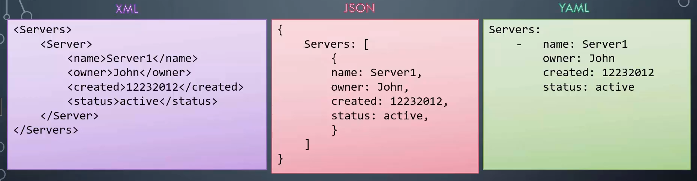
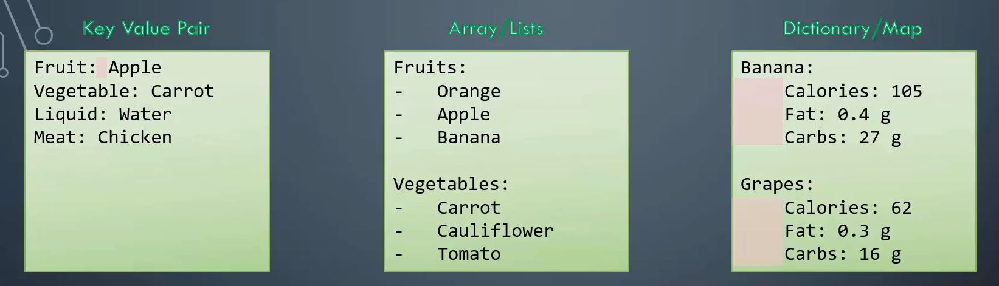
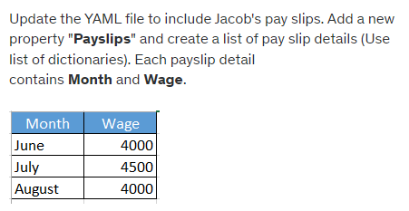
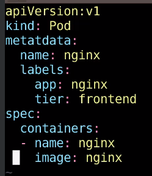
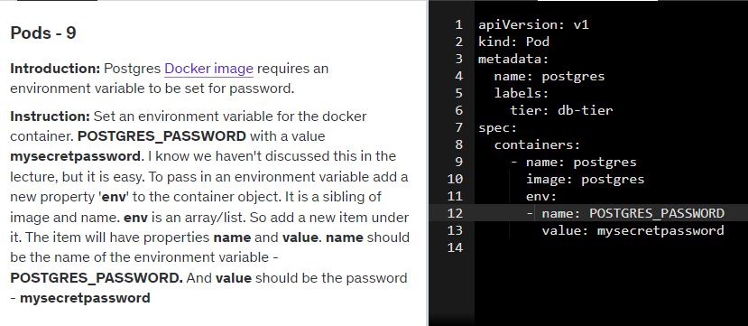
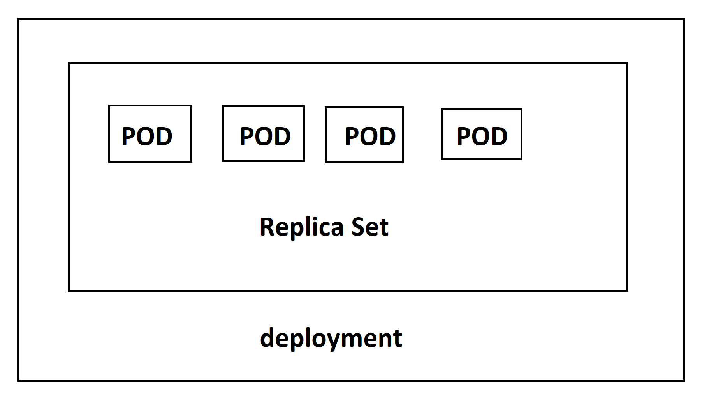

kubernetes or k8s
build by google
open source

containers -> 
why we need containers?

compatibility with the operating system

version of different services with OS

upgrade/change same process again

new dev have to set 100s of commands to set env, right OS versions

env may behave differently

Docker running on different containers

build docker configuration only one and then dokcer run will do the job

containers are isolated env, as in they can have their own processes or services, their own networking interfaces, their own
mounts just like virtual machines, except they are all shared the same operating system kernel

sharing kernel 

contanier vs virtual machines

  

container orchestration

kubernetes

node(minions) - is a machine, physical or virtual on which kubernetes is installed.

what if node fails then application goes down. so more than one node is required

cluster - is set of nodes grouped together

master - is another node with kubernetes installed in it and is configured as master. manages nodes in cluster. it has kube-server, etcd, scheduler, controller

worker - it has kubelet agent

components:
- API server : front end for kubernetes. the users, management devices, command line interfaces, all talk to the API server to interact with the kubernetes cluster.
- etcd : is a distributed, reliable key value store used by kubernetes to store all data used to manage the cluster. info about all the nodes and master on all the nodes.
- kubelet : agent that runs on each node. responsible to make sure that containers are running on the nodes as expected
- container runtime : underlying software that is used to run containers. in out case docker
- controller : brain behind orchestration. They are responsible for noticing and responding when nodes, containers or end points goes down. make desicions to bring up new containers in such cases
- scheduler : is responsible for distributing work or containers across multiple nodes. it looks for newly created container and assigbs them to nodes.

#### Kubernetes organizes applications into pods, which run on nodes in the cluster. Each pod contains one or more containers that make up the application. Nodes provide the compute resources needed to run pods, and Kubernetes orchestrates the deployment and management of pods across the cluster.

kubectl - kube command line tool

kubectl run command is used to deploy an application on the cluster. 

`kubectl run hello-minikube`

kubectl info command is used to view information about the cluster.

`kubectl cluster-info`

kubeclt get nodes list all the nodes part of the cluster

`kubectl get nodes`

pods : the containers are encapsulated into a kubernetes object known as pods. it is the smallest object one can create in kubernetes. we create new pod with a new instance of the same application.

https://kubernetes.io/docs/tasks/tools/install-kubectl-windows/

https://minikube.sigs.k8s.io/docs/start/

what is YAML?

  

- used to represent data
- data in key value pair, separated by colon

  

- lists are ordered while dictionaries are unordered collections
- '#' for comment

### lab

  

<pre>
Employee:
  Name: Jacob
  Sex: Male
  Age: 30
  Title: Systems Engineer
  Projects:
    - Automation
    - Support
  Payslips:
    - Month: June
      Wage: 4000
    - Month: July
      Wage: 4500
    - Month: August
      Wage: 4000
</pre>

## Pods with YAML
- uses yaml files as inputs for creation of pods
- generally has apiVersion, kind, metadata and spec(root level properties)(required)
- in metadata name is string and labels are dictionary
- in spec containers are list/array
- for yaml use 2 spaces instead of tabs
- `kubectl apply` for new object

  

  

How many pods exist on the system?(current default namespace)

`kubectl get pods`

Create a new pod wiht the nginx image.

`kubectl run nginx --image=nginx`

How many pods are created now?

`kubectl get pods`

What is the image used to create the new pod?

`kubectl describe pod newpods-llstt`

Which nodes are these pods placed on?

`kubectl get pods -o wide`

How many container are part of the pod webapp?

`kubectl describe pod webapp`

What images are used in the new webapp pod?

`kubectl describe pod webapp`

What is the state of the container agentx in the pod webapp?

`kubectl describe pod webapp`

What does the READY column in the output of the `kubectl get pods` command indicate?

"running containers in POD/Total containers in POD"

Delete the webapp pod

`kubectl delete pod webapp`

Create a new pod with name redis and image redis123

`kubectl run redis --image=redis123 --dry-run=client -o yaml`
`kubectl create -f redis.yaml`

Now change the image on this pod to redis

`kubectl set image pod/redis redis=redis`
 

### 

more than one instance/pod running at the same time on the node

replicaiton controller helps us run multiple instance

high availability

even if single pod replication controller ensures specified number of pods are running even if it is 1 or 100

for load balancing adding more pods

both have same purpose

- replication controller: older tech

- replica set: new recommended wat

### replication controller

<pre>
apiVersion: v1
kind: ReplicationController
metadat:
  name: myapp-rc
  labels:
    app: myapp
    type: front-end
spec:
  template:
    metadata:
      name: myapp-pod
      labels:
        app: myapp
        type: front-end
    spec:
      containers:
      - name: nginx-container
        image: nginx
  replicas: 3
</pre>

`kubectl create -f rc-defintion.yml`

>> replicationcontroller "myapp-rc" created

`kubectl get replicationcontroller`

>> count is 3

`kubectl get pods`

### replica set

<pre>
apiVersion: apps/v1
kind: ReplicationSet
metadat:
  name: myapp-replicaset
  labels:
    app: myapp
    type: front-end
spec:
  template:
    metadata:
      name: myapp-pod
      labels:
        app: myapp
        type: front-end
    spec:
      containers:
      - name: nginx-container
        image: nginx
  replicas: 3
  selector: 
    matchlabels:
      type: front-end
</pre>

`kubectl create -f replicaset-definition.yml`

>> replicaset "myapp-replicaset" created

`kubectl get replicaset`

>> count is 3

`kubectl get pods`

### commands

`kubectl create -f replicaset-definition.yml`

`kubectl get replicaset`

`kubectl delete replicaset myapp-replicaset`

`kubectl replace -f replicaset-definition.yml`

`kubectl scale --replicas=6 -f replicaset-definition.yml`

`kubectl edit replicaset myapp-replicaset`

### Deployments

  

- deployment-definition.yaml file same as replicaset only difference is the kind

`kubectl get all`

`kubectl get deployments`

`kubectl describe deployment myapp-deployment`

`kubectl create deployment httpd-frontend --image=httpd:2.4-alpine --replicas=3`

<pre>
apiVersion: apps/v1
kind: Deployment
metadata:
  name: myapp-deployment
  labels:
    tier: frontend
    app: nginx
spec:
  selector:
    matchlabels:
      app: myapp
  replicas: 3
  template:
    metadata:
      name: nginx-2
      labels:
        app: nginx
    spec:
      containers:
      - name: nginx
        image: nginx
</pre>

Recreate and RollOut strategies

a rolling update is a specific type of deployment strategy used to update pods in a controlled manner, while a rollout refers to the broader process of updating a deployment's configuration. Rolling updates are often achieved through rollouts

`kubectl rollout undo deployment/myapp-deployment`

`kubectl rollout history deployment/myapp-deployment`

`kubectl rollout status deployment/myapp-deployment`

`kubectl set image deployment/myapp-deployment nginx=nginx:1.9.1`

`kubectl apply -f deployment/myapp-deployment`

- i for editing in vim
- press esc for normal mode
- press :wq to save and exit

### Networking in kubernetes

- IP address is assigned to a POD
- all the container/pods can communicate to one another wihtout NAT
- all nodes can communicate with all coatainers and vice-versa wihtout NAT
- Network Address Translation (NAT)
- This is because pods within the same Kubernetes cluster are part of the same Kubernetes network and can communicate with each other using their IP addresses directly.

